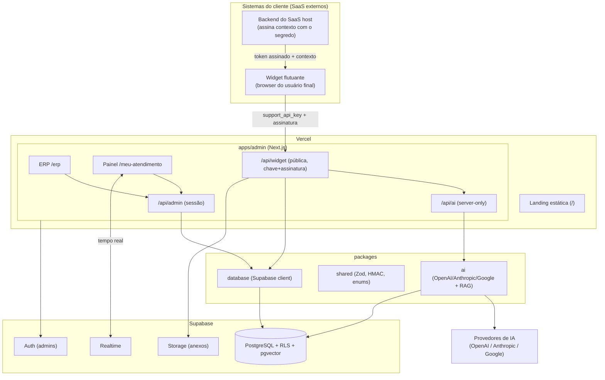
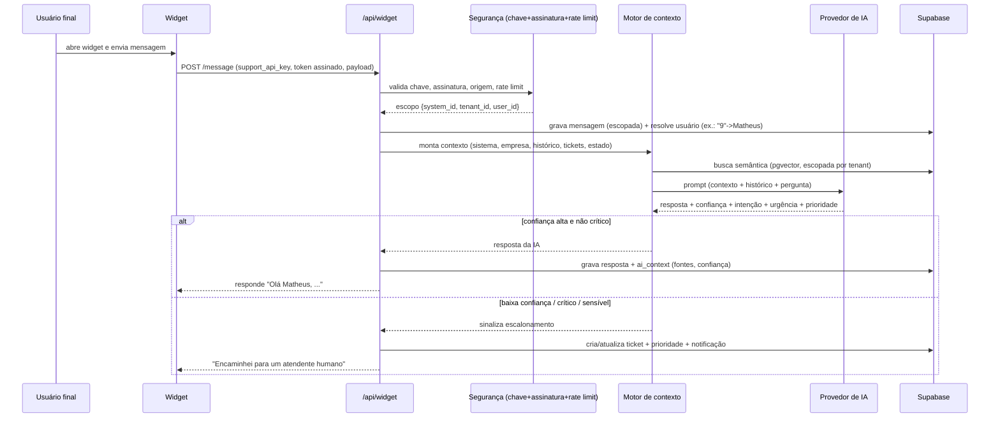
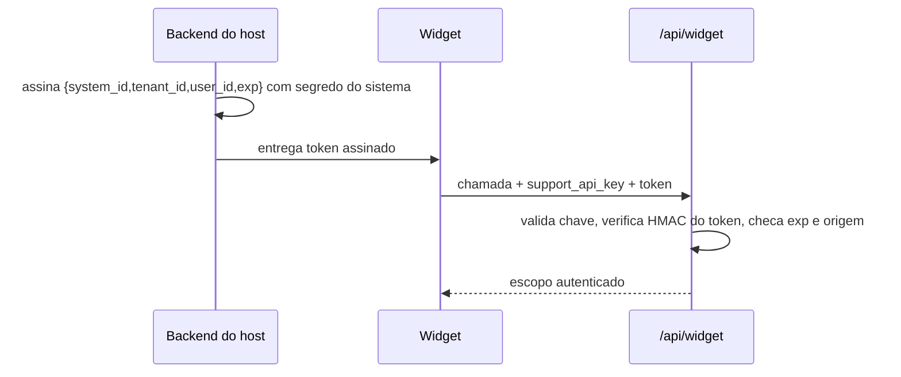
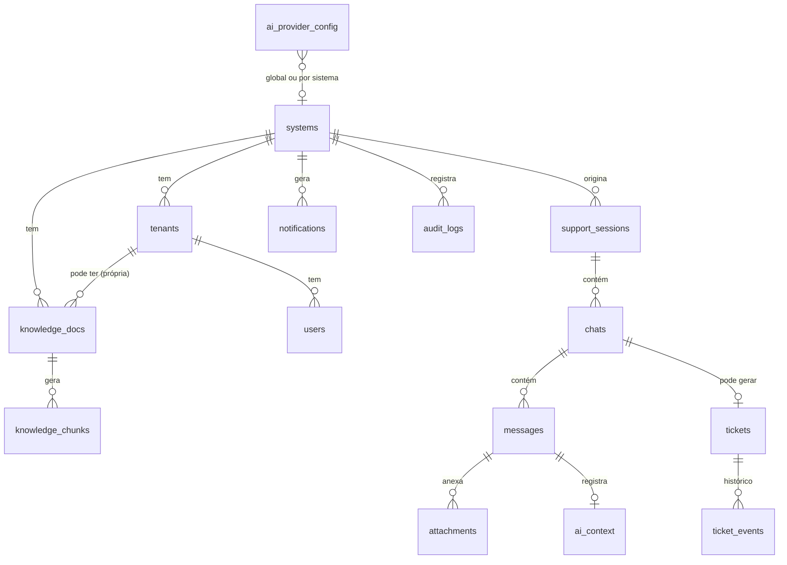

# Documento de Design — Plataforma Synova (ERP + Suporte Inteligente)

## Visão geral

A plataforma é um monorepo composto por um **cockpit administrativo** (ERP + painel de
suporte), um **widget embutível** e um **backend Supabase** compartilhado. O ERP alimenta o
contexto que a IA do suporte consome; o suporte atende os usuários finais via widget, com IA
respondendo dúvidas simples e escalando as complexas para o humano (o dono).

Princípios que guiam o design:
- **Isolamento multi-tenant por padrão** (RLS + escopo obrigatório em toda consulta).
- **Segurança em profundidade** (validação de chave + assinatura, Zod em todas as bordas, segredos fora do cliente, rate limiting).
- **Provedor de IA plugável** (OpenAI, Anthropic, Google) atrás de uma interface única.
- **Nada é apagado** (arquivar/ocultar, nunca deletar).
- **Testabilidade** (camadas desacopladas, contratos de entrada/saída validáveis).
- **Landing preservada** (o site em `apps/admin/public` é a área do front-end e não é alterado pelo backend).

### Mapeamento requisitos → design (resumo)
- R1–R6 (ERP, hierarquia, contexto, usuários, IA, interligação) → ERP (cockpit) + `packages/ai` + modelo de dados.
- R7, R8, R23 (chave, isolamento, segurança) → autorização de widget (chave + token de sessão), RLS, guarda de borda.
- R9, R10, R11 (widget, IA, contexto/RAG) → `apps/widget`, API pública, motor de contexto.
- R12–R14 (tickets, escalonamento, prioridade) → serviço de atendimento + IA estruturada.
- R15–R17 (painel, retenção, notificações) → painel de suporte + Realtime.
- R18 (auth admin) → Supabase Auth + proxy (Next 16).
- R19–R22, R24, R25 (anexos, auditoria, métricas, dados, testes, deploy) → Storage, tabelas, dashboards, estratégia de testes, Vercel.

---

## Arquitetura

### Estrutura do monorepo

```
plataforma/
├── apps/
│   ├── admin/                 # Next.js (App Router) — cockpit protegido
│   │   ├── app/
│   │   │   ├── (auth)/login/          # login admin
│   │   │   ├── erp/                    # ERP: projetos, contexto, usuários, IA
│   │   │   ├── meu-atendimento/        # Painel: chats, tickets, métricas, notificações
│   │   │   └── api/
│   │   │       ├── admin/              # APIs internas (protegidas por sessão)
│   │   │       ├── widget/             # APIs públicas do widget (chave + assinatura)
│   │   │       └── ai/                 # processamento de IA (server-only)
│   │   └── proxy.ts                    # protege /erp e /meu-atendimento
│   └── widget/                # Widget embutível (bundle standalone, leve)
│       └── src/                        # UI flutuante + cliente da API
├── packages/
│   ├── database/              # (existe) clientes Supabase + tipos gerados
│   ├── shared/                # schemas Zod, tipos de domínio, enums, utils de assinatura
│   ├── ai/                    # abstração de provedores + motor de contexto (RAG) + classificação
│   └── ui/                    # componentes shadcn/ui compartilhados
└── supabase/                  # migrations, policies (RLS), config
```

Observação: isso substitui o plano anterior de `apps/erp` + `apps/meu-atendimento` separados. Como
ambos são áreas do mesmo cockpit protegido e compartilham sessão/UI, ficam em `apps/admin`
(ERP em `/erp`, suporte em `/meu-atendimento`). O widget é a única superfície pública.

### Diagrama de arquitetura



### Fluxo de atendimento (mensagem do widget)



---

## Componentes e interfaces

### 1. Widget embutível (`apps/widget`)

- Distribuído como um script (`embed.js`, servido em `/widget/embed.js`) que o site host inclui;
  auto-inicializa pela chave pública:
  ```html
  <script src="https://SEU-DOMINIO/widget/embed.js"
          data-synova-key="pk_..."
          data-title="Suporte" data-color="#4f46e5" defer></script>
  ```
  `data-synova-key` (chave pública do sistema) é obrigatória; `data-api-base` é opcional (cai para
  a origem do script). A autorização usa a chave pública + allowlist de origens (`allowed_origins`)
  e um token de sessão emitido por `POST /api/widget/session` (ver seção 2b).
- **Isolamento de estilo:** a UI do widget é renderizada dentro de **Shadow DOM** (ou iframe) para não conflitar com o CSS do host (R9.5).
- Bundle leve (alvo: pequeno) — implementação em React/Preact + Vite, sem trazer o peso do Next.
- Funções: chat flutuante, abrir ticket, enviar texto/imagem/arquivo, histórico recente, status (online/offline), notificações de resposta (via Realtime ou polling).
- Resiliência: se offline, mantém a mensagem em fila local e reenvia (R9.6).

### 2. Autenticação e identidade

Dois mecanismos distintos:

**a) Admin (ERP + painel)** — Supabase Auth (e-mail + senha). Um `proxy.ts` (convenção do Next 16,
antigo `middleware.ts`) protege `/erp`, `/meu-atendimento` e `/api/admin/*`. Autorização por papel
(`admin` = dono, `agent` = atendente) verificada no servidor (R18). Convite de novos admins pelo dono.

**b) Widget (usuário final)** — sem login no Supabase. O **backend do SaaS host** gera um
**token curto assinado (HMAC/JWT)** usando o segredo do sistema, contendo `system_id`,
`tenant_id`, `user_id` e expiração. O widget envia `support_api_key` + esse token. Nossa API
valida a assinatura com o segredo do sistema e deriva o escopo. Isso evita expor o segredo no
browser e impede spoofing (R7).

> **Nota de implementação:** na versão atual o widget não depende de um token assinado pelo host.
> A sessão é iniciada em `POST /api/widget/session`, que valida `support_api_key` + origem
> (`allowed_origins`) + rate limit e **emite um token de sessão**; as demais chamadas usam esse
> token. O modelo assinado pelo host (abaixo) fica disponível como evolução.

Fluxo (desenho original):



### 3. API pública do widget (`/api/widget/*`)

Route handlers Next.js (server). Endpoints principais:
- `POST /api/widget/session` — inicia sessão (valida contexto, retorna estado inicial + histórico recente).
- `POST /api/widget/message` — envia mensagem do usuário; dispara IA; retorna resposta ou escalonamento.
- `POST /api/widget/ticket` — abre ticket manualmente.
- `POST /api/widget/attachment` — upload (valida tipo/tamanho, grava no Storage escopado).
- `GET /api/widget/history` — histórico recente do usuário (escopado).

Todos: validam chave + assinatura + origem (CORS por sistema) + rate limit + Zod no corpo.
Respostas de erro sanitizadas (sem vazar detalhes internos).

### 4. Módulo de IA (`packages/ai`)

Interface única para os três provedores:

```ts
interface AIProvider {
  chat(input: ChatInput): Promise<ChatResult>;   // resposta + metadados estruturados
  embed(texts: string[]): Promise<number[][]>;    // embeddings (quando suportado)
}
type ChatResult = {
  answer: string;
  intent: string;
  urgency: "baixa" | "media" | "alta" | "critica";
  confidence: number;      // 0..1
  shouldEscalate: boolean;
  escalationReason?: string;
  suggestedPriority: Priority;
};
```

- Implementações: `OpenAIProvider`, `AnthropicProvider`, `GoogleProvider`. Uma `factory` lê a
  configuração ativa (`ai_provider_config`) e instancia o provedor certo. Trocar de provedor
  não afeta o resto do sistema (R5.4).
- **Saída estruturada** via JSON mode/function-calling para obter intenção, urgência,
  confiança, prioridade e decisão de escalonamento em uma única chamada (base para R8, R10, R14).
- **Degradação graciosa:** se não houver chave ativa ou o provedor falhar/estourar timeout, a
  IA não responde e o atendimento é escalado para humano, sinalizando no painel (R5.5, R24.4).

**Nota importante sobre embeddings:** Anthropic não oferece embeddings de primeira parte. Os
embeddings da base de conhecimento usam **um** modelo fixo por implantação; a coluna é
`vector(1536)`. **Em produção hoje:** Google `gemini-embedding-001` com `outputDimensionality: 1536`
(casa com a coluna). Trocar o modelo de embeddings exige reindexar. O **chat** pode usar qualquer
um dos três provedores independentemente do modelo de embeddings.

### 5. Base de conhecimento e busca semântica

- Documentos e o "contexto grande do sistema" ficam em `knowledge_docs`; são divididos em
  trechos (`knowledge_chunks`) e vetorizados (pgvector) para RAG.
- Busca por similaridade via função SQL (`match_knowledge`) que recebe o vetor da pergunta e
  **filtra por `system_id`/`tenant_id`** (isolamento), retornando os trechos mais próximos.
- Precedência de contexto (R11.1): base da Empresa > base global do Sistema, além de histórico,
  tickets e estado atual.

### 6. ERP (cockpit — `/erp`)

- **Hub:** grade de cards de Sistemas (imagem, nome, status, próprio/cliente), com busca/filtro
  e reordenação (R2).
- **Página do Sistema:** abas para
  - Visão geral + contato do cliente (aparece de forma simples aqui, embora armazenado no Tenant primário);
  - **Contexto do sistema** (editor de texto grande) + anotações;
  - **Documentação** (técnica/operacional/comercial/custom) que alimenta a IA;
  - **Usuários** (cadastro rótulo→pessoa, ex.: "9"→Matheus);
  - **IA** (provedor + chave, teste de conexão);
  - **Integração** (support_api_key, snippet do widget, allowlist de domínios, rotação de chave).
- Formulários com React Hook Form + Zod; dados via TanStack Query; estado de UI com Zustand.

### 7. Painel de Suporte (`/meu-atendimento`) + Realtime

- Lista unificada de chats e tickets, com **críticos em vermelho no topo** (R14.3, R15.5).
- Filtros por Sistema/Empresa/Usuário; visão de conversa com histórico e anexos.
- Ações: responder manual, **assumir da IA** (pausa auto-resposta na conversa), encerrar,
  reclassificar prioridade (com auditoria).
- **Tempo real:** assinatura Supabase Realtime nas tabelas `chats`, `messages`, `tickets`,
  `notifications` (o admin vê tudo; filtros no cliente). Atualização near real-time (R15.4).

### 8. Notificações (somente painel)

- Geradas para novo chat, novo ticket, ticket crítico, escalonamento, arquivo enviado, erro
  sistêmico (R17.1). Agrupadas por sistema/empresa/prioridade/status.
- **Sem e-mail e sem WhatsApp.** Estado (não lida/lida/resolvida) sem apagar o registro (R16, R17.5).

### 9. Anexos

- Upload validado (extensão + tamanho + bloqueio de tipos perigosos) com limites por tipo (R19).
- Armazenamento no Supabase Storage em caminho escopado `system_id/tenant_id/...`; acesso via
  **URL assinada com expiração** (sem URL adivinhável). Compressão de imagem opcional.

### 10. Auditoria

- `audit_logs` append-only registra validação/rejeição de chave, acessos negados,
  escalonamentos, transições de ticket, uploads e ações administrativas, com escopo e origem (R20).
- Consultável no painel, respeitando isolamento.

### 11. Métricas

- Dashboard com tickets por sistema/empresa, tempo médio IA/humano, taxa de resolução
  automática, taxa de escalonamento e satisfação (R21). Consultas agregadas (views SQL),
  respeitando o escopo dos filtros.

---

## Modelo de dados

### Diagrama ER (visão principal)



### Tabelas (resumo dos campos principais)

- **systems**: `id`, `name`, `slug`, `image_url`, `is_own` (próprio/cliente), `status`
  (active/inactive/archived), `support_api_key` (única), `key_secret_hash` (segredo p/ HMAC,
  guardado com hash/criptografia), `allowed_origins` (text[]), `support_config` (jsonb),
  `created_at`, `updated_at`.
- **tenants**: `id`, `system_id`→systems, `name`, `contact_name`, `contact_phone`, `plan`,
  `is_primary` (bool), `config` (jsonb), `created_at`, `updated_at`.
- **users**: `id`, `tenant_id`→tenants, `system_id` (denormalizado p/ escopo), `external_ref`
  (ex.: "9"), `name`, `email`, `role`, `sector`, `permissions` (jsonb), `created_at`.
- **knowledge_docs**: `id`, `system_id`, `tenant_id` (nullable = global do sistema), `kind`
  (technical/operational/commercial/custom), `title`, `content`, `metadata` (jsonb),
  `created_at`, `updated_at`.
- **knowledge_chunks**: `id`, `doc_id`→knowledge_docs, `system_id`, `tenant_id` (nullable),
  `content`, `embedding` `vector(N)`, `created_at`. Índice `ivfflat`/`hnsw` para similaridade.
- **ai_provider_config**: `id`, `provider` (openai/anthropic/google), `api_key_encrypted`,
  `model_chat`, `model_embeddings`, `is_active`, `system_id` (nullable = global), `created_at`,
  `updated_at`.
- **admins/profiles**: `id`→auth.users, `email`, `role` (admin), `created_at`.
- **support_sessions**: `id`, `system_id`, `tenant_id`, `user_id`, `channel`, `status`,
  `context_snapshot` (jsonb), `started_at`, `last_activity_at`.
- **chats**: `id`, `session_id`, `system_id`, `tenant_id`, `user_id`, `status`
  (ai_active/human_active/closed/archived), `assigned_admin_id` (nullable), `ai_paused` (bool),
  `created_at`, `updated_at`.
- **messages**: `id`, `chat_id`, `system_id`, `tenant_id`, `sender_type`
  (user/ai/admin/system), `sender_id`, `content`, `ai_meta` (jsonb), `created_at`.
- **tickets**: `id`, `chat_id` (nullable), `system_id`, `tenant_id`, `user_id`, `category`,
  `subject`, `description`, `priority` (low/medium/high/critical), `status`
  (open/in_progress/escalated/waiting_customer/resolved/closed), `escalation_reason`,
  `assigned_admin_id`, `created_at`, `updated_at`, `resolved_at`.
- **ticket_events**: `id`, `ticket_id`, `system_id`, `tenant_id`, `actor_type`, `actor_id`,
  `from_status`, `to_status`, `note`, `created_at`.
- **attachments**: `id`, `message_id` (nullable), `ticket_id` (nullable), `system_id`,
  `tenant_id`, `user_id`, `storage_path`, `file_name`, `mime_type`, `size_bytes`, `created_at`.
- **ai_context**: `id`, `message_id`, `system_id`, `tenant_id`, `sources` (jsonb),
  `confidence`, `provider`, `model`, `created_at`.
- **notifications**: `id`, `system_id`, `tenant_id` (nullable), `type`, `priority`, `title`,
  `body`, `entity_type`, `entity_id`, `status` (unread/read/resolved), `created_at`, `read_at`.
- **audit_logs**: `id`, `system_id` (nullable), `tenant_id` (nullable), `actor_type`,
  `actor_id`, `action`, `target_type`, `target_id`, `ip`, `metadata` (jsonb), `created_at`.

**Retenção (R16):** nenhuma operação de DELETE na aplicação. "Remover" = `status=archived`/
`hidden`. Sem cascatas destrutivas.

### Isolamento multi-tenant (RLS) — estratégia

1. **RLS habilitado em todas as tabelas multi-tenant.** Sem acesso direto do papel anon.
2. **Widget:** as chamadas passam pelas route handlers do servidor. Após validar chave +
   assinatura, o servidor executa o acesso ao banco **escopado** por `system_id`/`tenant_id`.
   Duas opções, decididas na implementação:
   - (a) **JWT de escopo curto** minerado pelo servidor com claims `system_id`/`tenant_id`, usado
     no cliente Supabase para que as **policies RLS** apliquem o filtro automaticamente (preferida
     — a isolação é garantida pelo banco); ou
   - (b) **service role** apenas no servidor + camada de acesso que injeta o filtro
     obrigatoriamente + testes de isolamento. RLS permanece como rede de proteção.
3. **Admin:** autenticado via Supabase Auth com `role=admin`; policies permitem leitura ampla
   (o dono vê todos os tenants no painel central), mas toda ação é auditada.
4. **Helpers de acesso** em `packages/database` recebem sempre o escopo e nunca permitem
   consulta sem `system_id` (falha em tempo de compilação/execução se faltar).
5. Testes automatizados tentam explicitamente acessar dados de outro tenant e **devem falhar**
   (R8.6, R24.2).

---

## Segurança

- **Validação de chave + assinatura** em todo endpoint público; origem via CORS por
  `allowed_origins` do sistema.
- **Rate limiting** por `support_api_key` e por IP (Upstash Redis ou limitador em edge);
  bloqueio temporário em abuso (R23.1, R23.5).
- **Zod** valida e sanitiza toda entrada no cliente e no servidor; contratos de API tipados
  compartilhados em `packages/shared` (R23.2, R24.1).
- **Segredos** (service role do Supabase, chaves de IA, segredos de sistema) só no servidor /
  criptografados; nunca no browser nem em logs (R5.3, R23.4).
- **Cabeçalhos de segurança** (CSP quando aplicável), HTTPS obrigatório.
- **Erros sanitizados**: mensagens genéricas ao cliente; detalhes só em logs/Sentry (R23.6).
- **Auditoria** de eventos sensíveis (R20).

---

## Tratamento de erros

- Camada de API retorna envelope padrão `{ ok: false, code, message }` com `code` estável e
  `message` genérica; detalhes vão para Sentry + `audit_logs` quando relevante.
- Erros de validação (Zod) → 400 com lista de campos (sem vazar dados sensíveis).
- Falha de autenticação/assinatura → 401; acesso negado por tenant → 403 + auditoria.
- Rate limit → 429.
- Falha de provedor de IA/timeout → degrada para humano (cria/atualiza ticket) e responde ao
  usuário que foi encaminhado.

---

## Estratégia de testes

Ferramenta base: **Vitest** (unit/integration) + **Playwright** (E2E do painel, opcional) +
**k6/Artillery** (carga). Supabase local (`supabase start`) para integração.

- **Entrada/saída de dados (R24.1):** cada endpoint e schema Zod testado com payloads válidos e
  inválidos; contratos de request/response verificados.
- **Isolamento multi-tenant (R24.2):** testes que tentam ler/escrever cross-tenant e exigem
  falha (401/403), incluindo via RLS.
- **Segurança (R24.3):** chave inválida/expirada, assinatura adulterada, rate limit, upload de
  tipo perigoso/oversize.
- **Falha (R24.4):** provedor de IA indisponível/timeout → escalonamento; dependências fora →
  degradação graciosa.
- **Carga (R24.5):** endpoints do widget (`/message`) e do painel sob concorrência.
- **Portões de pré-deploy (R24.7):** suíte de isolamento + segurança + contratos deve passar; o
  pipeline falha se algum teste de isolamento quebrar.

---

## Implantação (Vercel)

- **App:** `apps/admin` implantado na Vercel (framework Next.js). Variáveis de ambiente do
  `.env.example` (Supabase, chaves de IA, segredos, Sentry).
- **Widget:** `apps/widget` build gera `embed.js` versionado, servido por URL estável.
- **Domínio/landing:** a landing estática fica em `apps/admin/public` e é servida pelo próprio app
  Next — a rota `/` reescreve para `home.html` (`next.config.ts`). Assim, landing (`/`), cockpit
  (`/erp`, `/meu-atendimento`) e APIs do widget (`/api/widget/*`) convivem no mesmo domínio da Vercel.
- **Banco:** migrations versionadas em `supabase/migrations`; RLS aplicado por migration.
- **Rollback (R24.8):** deploys imutáveis da Vercel permitem reverter; migrations escritas de
  forma aditiva/reversível.

---

## Decisões em aberto (para confirmar na implementação, não bloqueiam o design)
1. **Modelo de embeddings** (OpenAI 1536 vs Google 768) — fixa a dimensão do `vector`. Sugestão: OpenAI `text-embedding-3-small`.
2. **Isolamento do widget** via **Shadow DOM** (mais leve) vs **iframe** (isolamento total). Sugestão: Shadow DOM.
3. **Escopo do widget no banco** via **JWT de escopo (RLS)** vs **service role + camada escopada**. Sugestão: JWT de escopo.
4. **Rate limiting** com **Upstash Redis** (serverless-friendly) vs limitador em memória/edge. Sugestão: Upstash quando houver volume.
```
